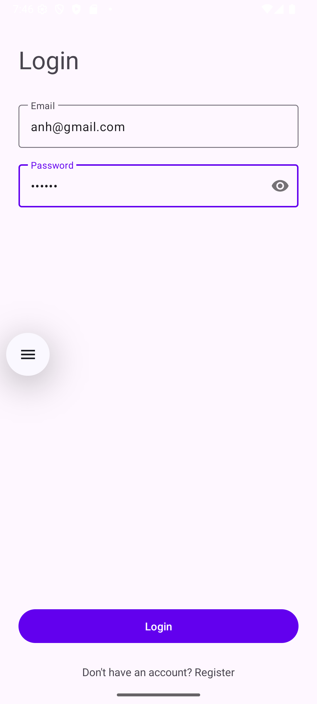
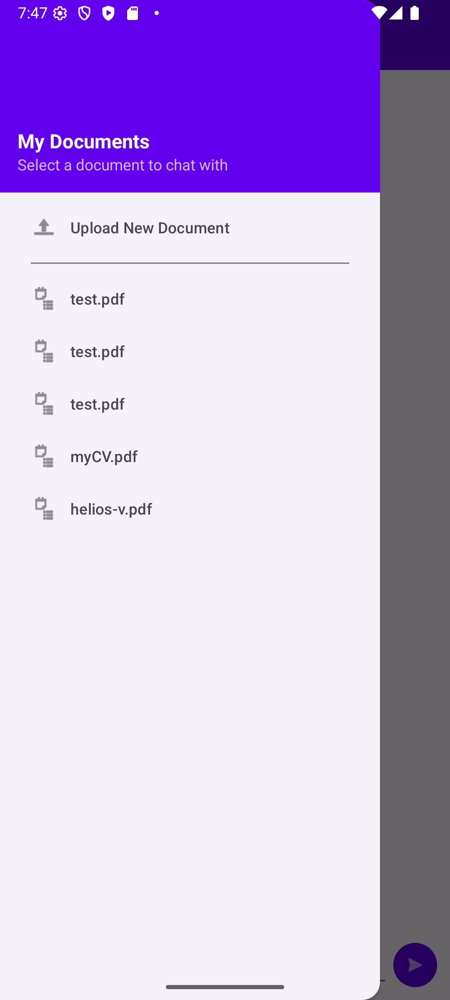
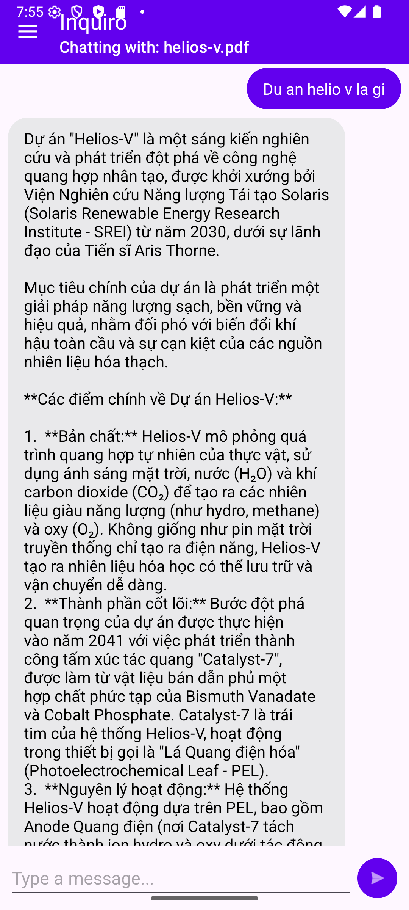
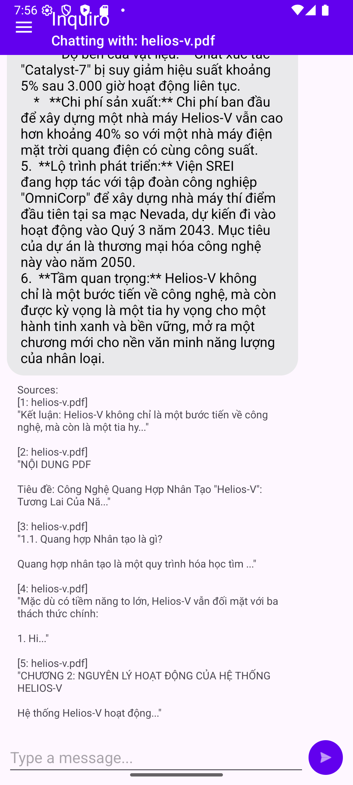

---

# Inquiro - Client Android

Đây là client Android chính thức cho dự án **[Inquiro AI](https://github.com/phanlerda/inquiro-ai)**, một chatbot RAG (Retrieval-Augmented Generation) thông minh cho phép người dùng trò chuyện trực tiếp với nội dung tài liệu của chính họ.

Ứng dụng này cung cấp một giao diện di động, mượt mà để tương tác với các tính năng mạnh mẽ của backend Inquiro AI.

## ✨ Tính năng

-   **Xác thực người dùng:** Đăng ký và đăng nhập an toàn bằng tài khoản.
-   **Quản lý tài liệu:**
    -   Tải lên các tài liệu (PDF, TXT, v.v.) trực tiếp từ điện thoại.
    -   Xem danh sách các tài liệu đã tải lên trong một menu điều hướng (Navigation Drawer).
-   **Trò chuyện thông minh:**
    -   Chọn một tài liệu và bắt đầu cuộc trò chuyện về nội dung của nó.
    -   Lịch sử trò chuyện được duy trì để các câu hỏi sau có ngữ cảnh.
-   **Trích dẫn nguồn:** Hiển thị rõ ràng các đoạn văn bản (sources) đã được AI sử dụng để tạo ra câu trả lời, đảm bảo tính minh bạch và chính xác.
-   **Kiến trúc hiện đại:** Xây dựng trên nền tảng MVVM (Model-View-ViewModel) vững chắc, dễ bảo trì và mở rộng.

## 📸 Demo

<p align="center">
  
</p>

<p align="center">
  
</p>

<p align="center">
  
</p>

<p align="center">
  
</p>

## 🛠️ Tech Stack

-   **Ngôn ngữ:** Java
-   **Kiến trúc:** MVVM (Model-View-ViewModel)
-   **Giao diện (UI):** XML Layouts, View Binding, Material Components
-   **Mạng (Networking):** Retrofit2, OkHttp3, Gson
-   **Bất đồng bộ (Asynchronous):** RxJava3
-   **Quản lý vòng đời (Lifecycle):** AndroidX Lifecycle (ViewModel, LiveData)

## 🚀 Cài đặt và Chạy thử

Để chạy dự án này, bạn cần thực hiện hai bước chính: cài đặt **Backend** trước, sau đó cài đặt **Client Android**.

### Yêu cầu

-   Android Studio (phiên bản mới nhất được khuyến nghị)
-   JDK 11 hoặc cao hơn
-   Máy ảo Android (Emulator) hoặc thiết bị Android thật

### Bước 1: Cài đặt Backend (Inquiro AI)

Để ứng dụng Android có thể hoạt động, bạn **bắt buộc** phải cài đặt và chạy server backend trước. Backend xử lý tất cả logic về AI, RAG và quản lý dữ liệu.

1.  Clone repository của dự án backend từ GitHub:
    ```bash
    git clone https://github.com/phanlerda/inquiro-ai.git
    ```

2.  Sau khi clone, truy cập vào thư mục `inquiro-ai` và làm theo hướng dẫn trong file `README.md` của dự án đó để cài đặt môi trường, API keys và khởi chạy server.

3.  Đảm bảo server đang chạy và có thể truy cập tại `http://localhost:8000`.

### Bước 2: Cài đặt Client Android

1.  Clone repository này (hoặc mở dự án nếu bạn đã có sẵn).

2.  Mở dự án bằng Android Studio.

3.  Chờ Android Studio hoàn tất việc đồng bộ hóa Gradle.

4.  **Kiểm tra địa chỉ IP của API:**
    -   Mở file `app/src/main/java/com/inquiro/app/data/remote/ApiService.java`.
    -   Đảm bảo hằng số `BASE_URL` được đặt đúng. Mặc định, nó được đặt là `http://10.0.2.2:8000/api/v1/`. Địa chỉ IP `10.0.2.2` là địa chỉ đặc biệt để máy ảo Android có thể truy cập `localhost` của máy tính host.
    -   Nếu bạn chạy trên thiết bị thật, hãy thay `10.0.2.2` bằng địa chỉ IP của máy tính host trong cùng mạng Wi-Fi (ví dụ: `http://192.168.1.10:8000/api/v1/`).

5.  Nhấn nút **'Run' (▶️)** trong Android Studio để cài đặt và chạy ứng dụng trên máy ảo hoặc thiết bị thật.

6.  Sau khi ứng dụng khởi chạy, bạn có thể:
    -   Đăng ký một tài khoản mới.
    -   Đăng nhập vào ứng dụng.
    -   Mở menu điều hướng (vuốt từ cạnh trái) và tải lên tài liệu đầu tiên.
    -   Chọn tài liệu và bắt đầu trò chuyện!

## 🏗️ Cấu trúc Dự án

Dự án tuân theo kiến trúc Clean Architecture được phân lớp rõ ràng, giúp dễ dàng quản lý và mở rộng.

```
com.inquiro.app/
├── data/                  # Lớp dữ liệu (Repository, API, Local Storage)
│   ├── local/             # SharedPreferences
│   ├── remote/            # Retrofit, ApiService, DTOs
│   └── repository/        # AppRepository
└── presentation/          # Lớp giao diện (UI Layer)
    ├── auth/              # Login, Register Activities & ViewModel
    └── chat/              # Main Chat Activity, Adapter & ViewModel
```

## 📄 Giấy phép

Dự án này được cấp phép dưới Giấy phép MIT. Xem file `LICENSE` để biết thêm chi tiết.